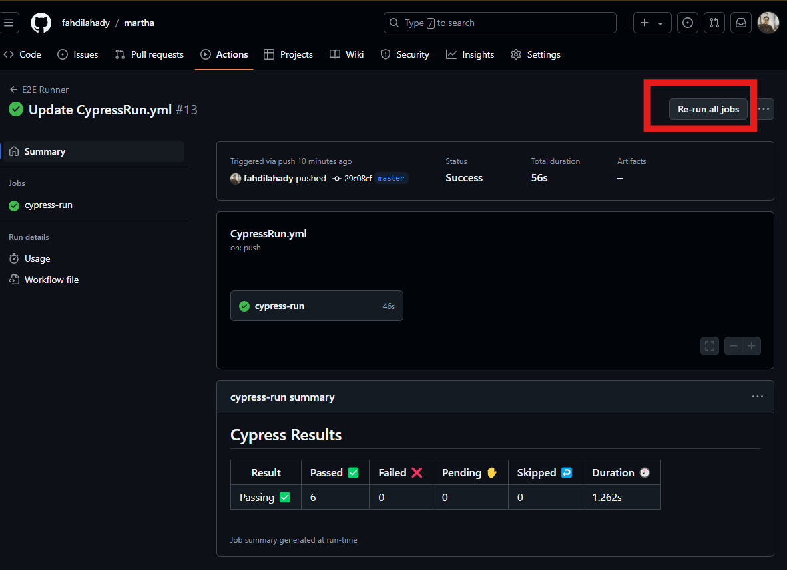

# SauceDemo.com Automation Test

## Project setup
[](https://www.cypress.io/)

Versions used:
- Node 18.12.0
- NPM 8.19.2
- cypress [11.2.0](https://docs.cypress.io/guides/references/changelog#11-2-0)

### Steps:
1. download NVM and install it to manage node version:
- [nvm download link](https://github.com/coreybutler/nvm-windows/releases)
- pick any file support your OS.

2. Install node and npm with node version manager (nvm):

    ```sh
    nvm install 18.12.0
    ```

3. [Clone This Project or Unzip](https://github.com/fahdilahady/martha.git)

4. Then in this projects root install all dependency packages by run below command

    ```sh
    npm install
    ```
    
## Run Test

in the terminal, go to this project directory and run below npmc command

1. To Open Cypress IDE, and run specific test case
    ```sh
    npm run test
    ```

2. To Run whole test scenario in terminal view
    ```sh
    npm run test:run
    ```

## Continous Integrity
This project can be run on "Github Action", so you dont need to setup it locally to find out how it's work. To check this project run result you can follow below links

- [Re-Run Test Using Last Commit](https://github.com/fahdilahady/martha/actions/workflows/CypressRun.yml), find the latest job and click on highlighted button
  
- To check Results screen shoot or video of [Last Run](https://fahdilahady.github.io/martha/)

with this you can also check the logs of the run jobs and inspect the artifact. just click on "cypress-run" button.
